# FCSS-devnet architecture

How the local **Filecoin Cold Storage Service** stack fits together: services, on-chain contracts, identities (IDs and wallets), and how money and deals flow between them.

This is the mental model for Curio + Lotus, PoRep Market V2, Filecoin Pay, Hyperion, [URL Finder / RPA](https://github.com/fidlabs/provider-sample-url-finder), and adjacent apps such as the [PIDS / TOADS directory frontend](https://github.com/fidlabs/pids-frontend). Contract code and `extern/*/README.md` remain authoritative for ABIs and edge cases.

---

## 1. Layered stack

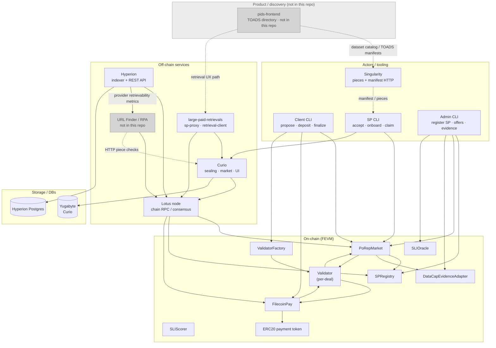

Grey nodes (**PIDS**, **URL Finder / RPA**) are **not** shipped in this repo — optional adjacent services.

| Layer | What lives here |
|-------|-----------------|
| **Product / discovery** | [pids-frontend](https://github.com/fidlabs/pids-frontend) TOADS directory (*external*, not in this docker-devnet) |
| **Actors** | Humans / scripts that propose deals, onboard data, register SPs |
| **Off-chain** | Curio (SP runtime), Lotus (chain), Hyperion (index), [URL Finder / RPA](https://github.com/fidlabs/provider-sample-url-finder) (*external*), retrieval clients |
| **On-chain** | Market, registry, evidence, per-deal validators, Filecoin Pay rails |
| **Storage** | Curio Yugabyte; Hyperion Postgres |

---

## 2. Services

### Lotus

- Filecoin full node for the local Curio docker-devnet chain.
- FEVM RPC surface used by tooling and Hyperion (`Filecoin.*` + Ethereum JSON-RPC).
- Host RPC (FCSS defaults): `http://127.0.0.1:2234/rpc/v1`.

### Curio

- Storage-provider stack: sealing pipeline, market HTTP, UI, miner actors.
- Configures **MinerAddresses** (`f0…` / `t0…`) — these are the **provider / miner IDs** registered in SPRegistry.
- Onboards deal pieces (e.g. via `curio market ddo`) after the SP CLI claims allocations.
- Host UI (FCSS): `http://127.0.0.1:24701`.

### PoRep Market (contracts)

| Contract | Role |
|----------|------|
| **PoRepMarket** | Deal lifecycle, frozen terms/SLIs, settlement decisions, org snapshot |
| **SPRegistry** | Providers, orgs, payees, capacity, offers, matching |
| **DataCapEvidenceAdapter** | Allocations / claims → covered bytes for activation |
| **ValidatorFactory** | Deploys a **Validator** beacon proxy per deal |
| **Validator** | Filecoin Pay operator for that deal’s rail; asks PoRepMarket for settlement amounts |
| **SLIOracle / SLIScorer** | Attestations and score vs frozen SLI thresholds |

Deployed by `just porep-market deploy`; addresses live under `extern/porep-market/deployments/devnet/`.

### Filecoin Pay

- Holds client deposits (per token / account).
- Creates **payment rails** (`from` client → `to` payee) operated by the deal’s Validator.
- Settles rails when an authorized operator calls settle; Validator validates amounts via PoRepMarket.

### Hyperion

- Indexes PoRep Market + Filecoin Pay events from genesis on the local chain.
- Exposes REST for deals and rails (`/po-rep/*`, `/filecoin-pay/*`).
- Optionally ingests provider retrievability from URL Finder (`URL_FINDER_API_URL`).
- Host HTTP (FCSS): `http://127.0.0.1:23300` (`/docs`, `/`).

### URL Finder / RPA ([fidlabs/provider-sample-url-finder](https://github.com/fidlabs/provider-sample-url-finder))

- Microservice for **Random Piece Availability (RPA)**: map storage provider IDs to sample HTTP retrieval URLs and measure retrievability / bandwidth.
- Two flows:
  - **Provider flow** — discover SP HTTP endpoints (Lotus peer IDs, `cid.contact`, filspark), test piece URLs, store provider-level retrievability / URL / BMS metrics.
  - **Deal SLI flow** — register a deal target (provider, manifest hash/URL, size, optional SLI requirements); RPA verifies the manifest, samples pieces, and exposes deal-level SLI state.
- APIs: `/deals/*` (Deal SLI, bearer auth), `/providers/*`, `/clients/*`, legacy `/url/*`. Local default port `3010` (Swagger at `/`).
- **Not** started by `just up` in this repo; Hyperion optionally points at a running instance via `URL_FINDER_API_URL`.
- Feeds Hyperion’s `provider_url_finder_*` tables.

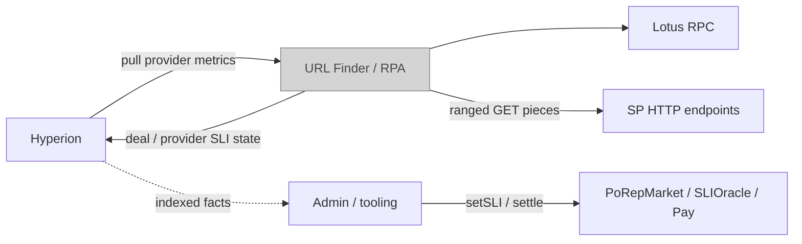

### Tooling CLI (`filecoin-porep-market-tooling`)

- Stateless CLI (client / sp / admin) over Web3 + Lotus wallet or private keys.
- Orchestrated in FCSS by `just make-deal` / `just seed-deals`.

### Singularity (optional, external)

- Builds piece CARs + `manifest.json`; serves them over HTTP for propose/onboard.
- Not a submodule; not part of on-chain identity.

### PIDS frontend ([fidlabs/pids-frontend](https://github.com/fidlabs/pids-frontend))

- Web app for the **Public Interest Datasets Service** / **TOADS** (The Open Access Dataset Standard) directory.
- Production: [https://toads.directory](https://toads.directory). Datasets follow the [TOADS / data-prep standard](https://github.com/fidlabs/data-prep-standard).
- Stack: React/Vite UI + API, MongoDB, Docker/k8s — **separate** from this FCSS-devnet compose bring-up (not an `extern/` submodule).
- Role relative to FCSS: **discovery / catalog** for public datasets that are prepared (manifests / pieces) and then stored via PoRep Market deals on Filecoin. Retrieval against stored data is typically exercised with [`large-paid-retrievals`](https://github.com/fidlabs/large-paid-retrievals) against this (or a similar) Curio/PoRep stack.
- Includes manifest-oriented helpers (e.g. `api/src/utils/manifestParser.js`) aligned with TOADS dataset packaging, which sits upstream of Singularity-style piece serving used by `just make-deal`.

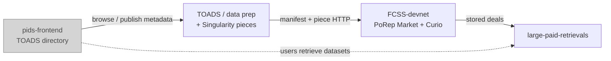

### large-paid-retrievals (adjacent)

- [`fidlabs/large-paid-retrievals`](https://github.com/fidlabs/large-paid-retrievals): `sp-proxy` + `retrieval-client` for paid retrievals against this devnet.
- Consume public contract addresses via `eval "$(just porep-market tooling-env)"` (see [README.md](README.md)).

---

## 3. Identities: IDs and wallets

PoRep Market mixes **Filecoin actor IDs** (miner / provider) with **EVM addresses** (org, client, payee, validator). They are not interchangeable.

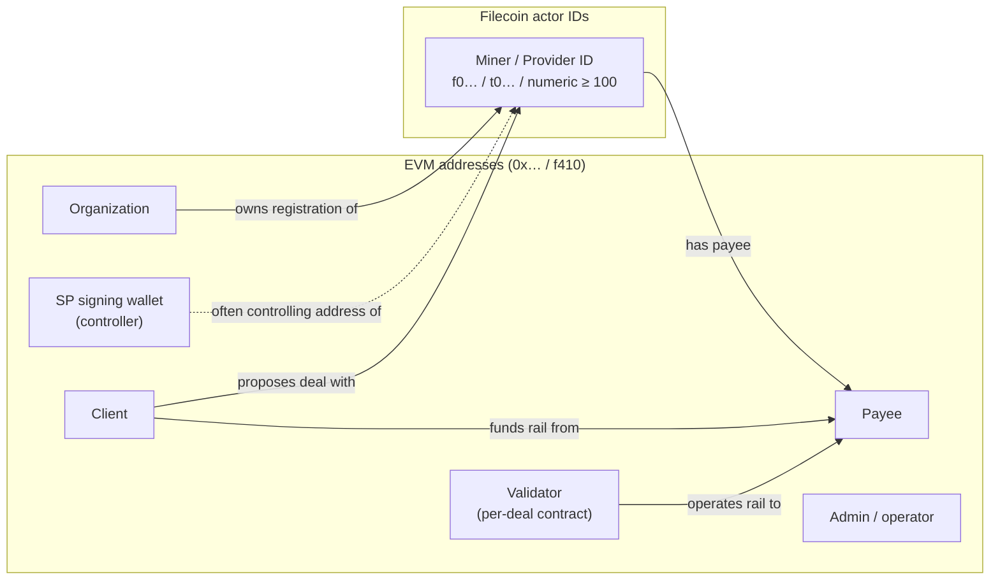

### ID and wallet glossary

| Name | Format | What it is | Where set / looked up |
|------|--------|------------|------------------------|
| **Provider ID** (= **miner ID**) | `FilActorId` — `f01003`, `t01003`, or `1003` | Storage miner actor; primary SP key in market. **Allocated by Filecoin Init** at miner creation — not by PoRep Market | Chain: `lotus state list-miners`; Curio `MinerAddresses`; SPRegistry `provider` |
| **Organization** | EVM address | Owner of one or more provider registrations; groups deals (`getDealsForOrganizationByState`) | SPRegistry `organization`; frozen on deal as `providerOrganization` |
| **Payee** | EVM address | Receives Filecoin Pay settlements for that provider | SPRegistry `payee` (defaults to org if zero at register); frozen into deal selection / rail `to` |
| **Client** | EVM address | Deal proposer; Filecoin Pay account `from` on the rail | PoRepMarket deal `client`; rail `from` |
| **SP signing wallet** | EVM / Lotus wallet | Key that signs SP txs; **may differ** from organization | Tooling `SP_PRIVATE_KEY` / `SP_LOTUS_WALLET`; must be miner controller (or admin) for auth |
| **Client signing wallet** | EVM / Lotus wallet | Signs client txs (propose, deposit, create rail) | Tooling `CLIENT_PRIVATE_KEY` / `CLIENT_LOTUS_WALLET` |
| **Admin / operator** | EVM address | Registers SPs, submits evidence, privileged ops | Role on SPRegistry / PoRepMarket |
| **Validator** | Contract address | Per-deal Filecoin Pay operator + settlement gate | Created via ValidatorFactory; stored on deal |
| **Rail ID** | `uint256` | Filecoin Pay payment stream for a deal | Created by Validator; stored on deal as `railId` |
| **Deal ID** | `uint256` | Incremental deal key in PoRepMarket | `proposeDeal` |
| **Offer ID** | `uint256` | Provider offer selected at propose time | SPRegistry |
| **Evidence adapter** | Contract address | Adapter instance used for that deal’s storage evidence | Set at propose; usually DataCapEvidenceAdapter |

### Relationships (cardinality)

Multiplicities below are what the contracts enforce (or allow). Notation: **1** = exactly one, **0..1** = optional, **1..N** / **0..N** = many, **N..M** = many-to-many.

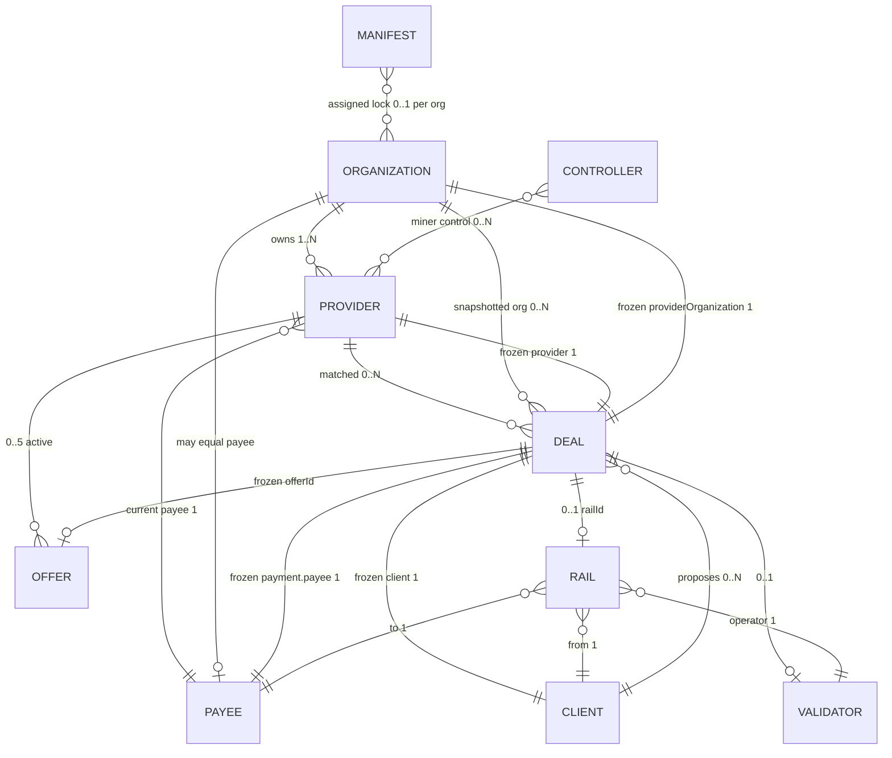

#### Multiplicity table

| From | To | Cardinality | Notes |
|------|-----|-------------|--------|
| **Organization** | **Provider** | **1 → 0..N** | One org owns many miners/providers (`registerProviderFor`). Max **100** providers registry-wide (`MAX_PROVIDERS`). Org address is fixed at registration (not updated by `setPayee`). |
| **Provider** | **Organization** | **N → 1** | Each provider has exactly one owning org. |
| **Provider** | **Payee** | **N → 1** (current) | Each provider has **exactly one** current payee. Defaults to org if payee was `address(0)` at register. Changed via `setPayee`. |
| **Payee** | **Provider** | **1 → 0..N** | Same payee wallet **may** receive for many providers (no uniqueness constraint). |
| **Organization** | **Payee** | **0..1 / often 1** | Same EVM address is common in simple setups; not required. |
| **Provider** | **Offer** | **1 → 0..5 active** | `MAX_ACTIVE_OFFERS_PER_PROVIDER = 5`. |
| **Provider** | **Deal** | **1 → 0..N** | Many deals can match the same provider over time. |
| **Client** | **Deal** | **1 → 0..N** | One client proposes many deals. |
| **Deal** | **Provider / Client / Org / Payee** | **1 → 1 each (frozen)** | At propose/match, deal stores provider, client, `providerOrganization`, and payment `payee`. Later `setPayee` on the provider does **not** rewrite old deals’ frozen payee / rail `to`. |
| **Deal** | **Validator** | **1 → 0..1** | Created when client deploys validator for the deal. |
| **Deal** | **Rail** | **1 → 0..1** | Created by validator (`createRail`); `railId` on deal. |
| **Rail** | **Client (`from`)** | **N → 1** | Payer account. |
| **Rail** | **Payee (`to`)** | **N → 1** | Settlement recipient (deal’s frozen payee). |
| **Rail** | **Validator** | **N → 1** | Operator / settlement callback (usually that deal’s validator). |
| **Controller wallet** | **Provider (miner)** | **N ↔ N** | Miner owner/worker/control addresses authorize callers (`MinerUtils.isControllingAddress`). Not the same as organization unless you set it that way. |
| **Manifest** | **Organization** | **N ↔ N (lock)** | At most one live assignment per `(manifestHash, organization)` while capacity is reserved/committed — blocks same org matching the same manifest again until release. |

#### Example shapes

```text
Organization 0xORG
 ├── Provider t01004  ──payee──►  0xPAYEE_A
 │    ├── Offer 1
 │    └── Deal 10  (frozen org=0xORG, payee=0xPAYEE_A, client=0xCLIENT)
 │         └── Rail 7  from=0xCLIENT  to=0xPAYEE_A  operator=Validator_10
 └── Provider t01005  ──payee──►  0xPAYEE_A     ← same payee, OK
      └── Deal 11  (frozen payee=0xPAYEE_A)

Controller wallet 0xCTRL  ──controls──►  t01004, t01005   (may ≠ 0xORG)
```

Important nuances:

- **Provider ID ≡ miner ID.** Same Filecoin actor ID; market code says “provider,” Lotus/Curio say “miner.”
- **Organization ≠ SP wallet** in general. Org owns registration; wallet signs. They can be the same address in simple setups.
- **Payee ≠ organization** in general. Payee can be updated via `setPayee`; org is fixed at registration.
- **One organization → many providers** (multiple miners under one org).
- **One payee ← many providers** is allowed; **one provider → many concurrent payees** is not (only the current payee field).
- **Auth for SP ops** is not “caller == organization”; it is admin/operator **or** `MinerUtils.isControllingAddress(provider, caller)`.

### Miner ID allocation

**PoRep Market does not mint miner IDs.** A miner ID is a Filecoin **actor ID** assigned by the chain’s **Init actor** when a miner actor is created (Power actor `CreateMiner` / tooling `actor new-miner`). IDs are monotonic integers; addresses are `f0{id}` on mainnet/calibnet and `t0{id}` on local/test nets. Low IDs are reserved for built-in system actors; miner IDs are typically ≥ 1000 on this devnet.

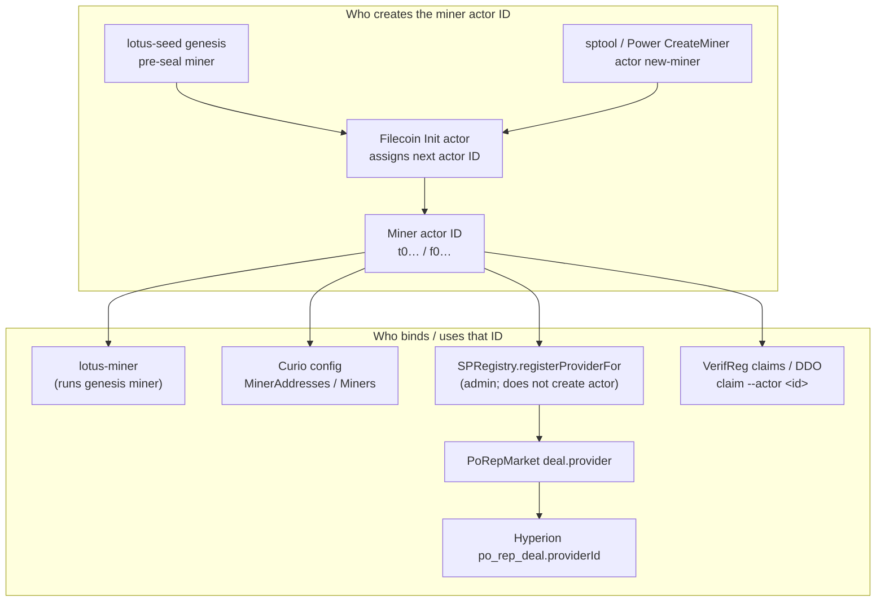

#### Devnet miners: IDs and purposes

This Curio docker-devnet creates **two miner actors**. They look similar (`t0…`) but serve different roles — do not treat them as interchangeable.

**Actor IDs are global** (every account, EVM contract, and miner shares one Init sequence). So the Curio miner is **not always `t01003`**. On a typical FCSS bring-up, `t01001`–`t01003` are often non-miner actors (eth accounts / early EVM), and the Curio miner lands at **`t01004`**. Always use `lotus state list-miners` — only storage-miner actors appear there.

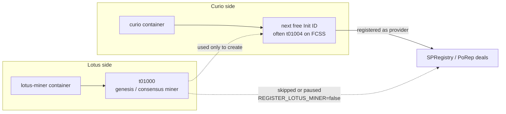

| Actor ID | Runtime | Purpose | PoRep Market |
|----------|---------|---------|--------------|
| **`t01000`** | **`lotus-miner`** container | **Genesis / consensus miner.** Pre-sealed into localnet genesis (`lotus-seed` → `lotus-miner init --genesis-miner --actor=t01000`). Keeps the chain producing blocks. Used as the bootstrap actor when Curio runs `sptool --actor t01000 actor new-miner`. | **Not** the deal SP by default. Skipped at `just porep-market up` (`REGISTER_LOTUS_MINER=false`). If already registered from an older run, setup **pauses** it so `proposeDeal` does not match it (Curio cannot seal for `t01000`). |
| **Curio miner** (often **`t01004`** on this stack; always “the `list-miners` entry that is not `t01000`”) | **`curio`** container | **Storage / deal miner.** Created on Curio first boot via `actor new-miner`; ID = next Init actor id. Written to Curio `MinerAddresses` / `Miners`. Seals sectors, runs market/DDO claims (`sptool --actor <id>`, `curio market ddo --actor <id>`). | **Registered** as SPRegistry `provider` + offers. This is the ID that appears on PoRep deals and in Hyperion as `providerId`. Stored as `CURIO_MINER_ID` in tooling `.env`. |

Example from a live FCSS chain (`lotus state get-actor`):

| ID | Code (typical) | On `list-miners`? |
|----|----------------|-------------------|
| `t01000` | `storageminer` | yes — lotus-miner |
| `t01001` | `ethaccount` | no |
| `t01002` | `ethaccount` | no |
| `t01003` | `evm` (contract) | **no** — not a miner |
| `t01004` | `storageminer` | yes — Curio miner |

Discover at runtime:

```bash
docker exec lotus lotus state list-miners
# typical FCSS: t01000  t01004

docker exec lotus-miner lotus-miner info | awk '/^Miner:/{print $2; exit}'
# → t01000

# Curio miner = the other list-miners entry
# or: env CURIO_MINER_ID / Curio harmony_config MinerAddresses

# see why an ID is missing from list-miners:
docker exec lotus lotus state get-actor t01003
# → Code: …/evm  (or ethaccount) — not storageminer
```

| Concern | Use this miner |
|---------|----------------|
| Block production / localnet consensus | `t01000` (`lotus-miner`) |
| PoRep propose / accept / onboard / claim | Curio miner (`CURIO_MINER_ID`, often `t01004`) |
| SPRegistry `provider` / deal `provider_id` | Curio miner |
| Hyperion deal `providerId` | Curio miner |
| `REGISTER_LOTUS_MINER=true` experiments | Also `t01000` (not needed for normal FCSS deals) |

##### Market escrow (what `t05` funding is)

**Market escrow** is FIL deposited into the built-in **Storage Market** actor (`t05` / `f05`) for an address, used as deal collateral / market balance — not a separate miner ID.

- Inspect: `lotus state market balance <addr>` → `Escrow` / `Locked`
- Curio setup (`scripts/curio/up.sh`) sends FIL into market escrow for the **Curio miner** (and historically also hard-codes `t01004` in that funding loop because that ID is often the Curio miner *or* an mk12 client target on this image). Funding uses something like `lotus send … --method 2 … t05` (AddBalance) with the beneficiary address in params.
- That is **orthogonal** to PoRep Filecoin Pay rails (ERC20 in FilecoinPay). Market escrow is classic Filecoin storage-market collateral; Pay rails are the PoRep deal payment stream.

If `list-miners` already shows `t01004` as the Curio miner, “fund `t01004` escrow” and “fund Curio miner escrow” are the same actor.

#### How the two miners are created

| Step | What happens | Typical ID |
|------|----------------|------------|
| Genesis | `lotus-seed` pre-seals and adds miner `t01000`; `lotus-miner` inits with `--actor=t01000` | **`t01000`** |
| Curio first boot | `sptool --actor t01000 actor new-miner …` creates a **second** miner; Init assigns the next free ID | Often **`t01004`** on FCSS (after eth/EVM actors claim 1001–1003) |
| Curio config | New miner written into Curio (`config new-cluster`, `Miners` / `MinerAddresses`) | Curio’s operating miner |
| SP wiring (`just porep-market up`) | Registers **Curio miner(s)** into SPRegistry; **skips** `t01000` by default | Same id as Curio miner |

#### Which components own vs consume the ID

| Component | Role wrt miner / provider ID |
|-----------|------------------------------|
| **Filecoin Init + Power** | **Allocate** the actor ID at miner creation |
| **lotus-miner** | **Runs** genesis miner `t01000` (consensus); does not run Curio’s deal miner |
| **Curio** | **Operates** the post-genesis miner (seal, prove, market, `sptool --actor <id>`); config must list that ID |
| **Lotus RPC** | **Source of truth** for which miner actors exist (`state list-miners`, miner actor state, control addresses) |
| **SPRegistry** | **Registers** an existing FilActorId as a market provider (org, payee, capacity); never allocates chain IDs |
| **PoRepMarket** | **Stores** `deal.provider` = that FilActorId; matching selects among registered providers |
| **MinerUtils / control addresses** | **Authorize** SP callers against the miner actor (owner/worker/control), not against org address alone |
| **DataCap / VerifReg / Curio DDO** | **Claim / allocate** storage against the same actor (`--actor <provider_id>`) |
| **Filecoin Pay** | Does **not** use miner ID on the rail (`from`/`to` are EVM payee/client); payee is looked up from SPRegistry by provider |
| **Hyperion** | **Indexes** `providerId` from market events into `po_rep_deal` (filter deals by provider) |
| **URL Finder / RPA** | **Measures** HTTP retrievability keyed by provider ID (and registered deal targets) |
| **Tooling CLI** | **Passes** `provider_id` / discovers via `sp get-registered-info` (SPRegistry), not by creating miners |

Mainnet / calibnet is the same split: the SP creates a miner on Filecoin first, then an admin/operator calls `registerProviderFor(providerId, organization, …)` so the market can match deals to that existing actor.

### Lookups

| Given | Want | How |
|-------|------|-----|
| Provider ID | Payee, organization | `SPRegistry.getProviderView(providerId)` |
| Organization | Provider IDs + payees | `getProviders()` then `getProviderView` and filter `organization` (no by-org getter) |
| Deal ID | Client, provider, org, validator, rail | PoRepMarket deal / deal view getters |
| Rail ID | `from`, `to`, operator, token | `FilecoinPay.getRail(railId)` |

---

## 4. On-chain contract relationships

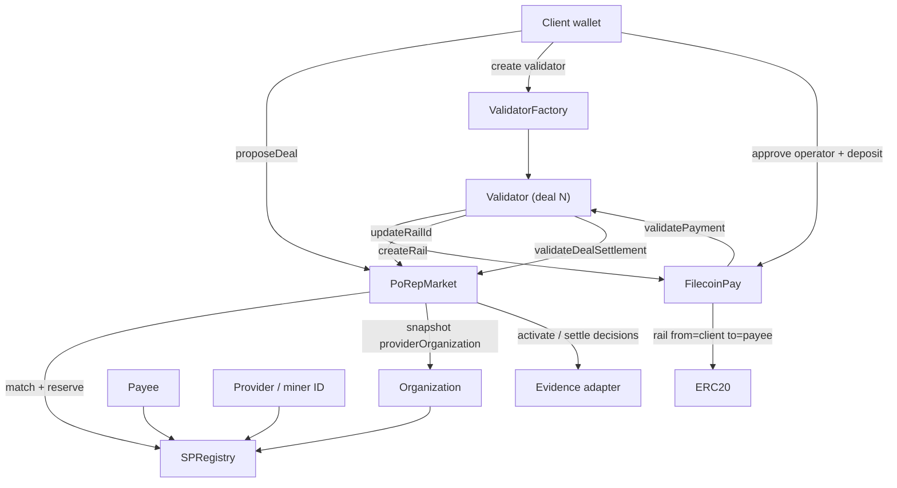

---

## 5. Deal lifecycle (happy path)

States (V2 tooling / market): **ACCEPTED** → **ACTIVE** → **FINALIZED** (also REJECTED / TERMINATED / EXPIRED paths).

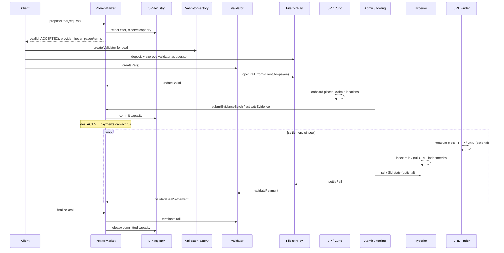

---

## 6. Off-chain data path (Hyperion + URL Finder)

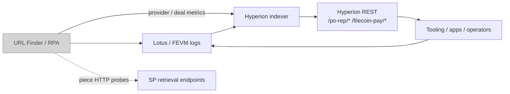

| Consumer need | Typical source |
|---------------|----------------|
| Rail `settledUpTo` / payee side of rail | Hyperion `GET /filecoin-pay/rails/:railId` |
| Indexed deals (filters: provider, piece CID, rail state, …) | Hyperion `GET /po-rep/deals` |
| Register deal for RPA measurement | URL Finder `/deals/*` |
| Provider sample retrieval URL / RPA | URL Finder `/providers/*`, `/url/*` |

Hyperion stores Filecoin Pay rails with `from` / `to` (payee) and joins them to deals via `railId`. URL Finder is optional locally; without it, provider/deal HTTP SLI inputs are empty or stale.

---

## 7. FCSS-devnet runtime map

How pieces show up when you `just up` on this repo:

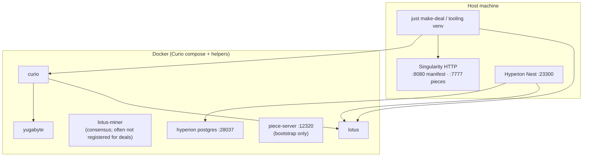

Default host ports: see [README.md](README.md) (“Host endpoints”) and `scripts/lib/ports.sh`.

---

## 8. Money flow (Filecoin Pay rail)

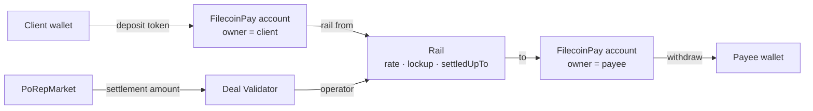

Rail fields (conceptual):

| Field | Typical value |
|-------|----------------|
| `from` | Client |
| `to` | Provider payee (from SPRegistry / frozen at match) |
| `operator` | Deal Validator |
| `validator` | Same Validator (settlement callback) |
| `token` | Allowed ERC20 from SPRegistry token config |

---

## 9. Quick reference: “who am I talking to?”

| You have… | Likely mean… |
|-----------|----------------|
| `t01000` / `f01000` | **lotus-miner** genesis / consensus miner (not the default PoRep deal SP) |
| `t01004` (or other non-`t01000` from `list-miners`) | **Curio** deal / sealing miner = PoRep `provider_id` (often `t01004` on FCSS; not always `t01003`) |
| `t01003` on FCSS | Often an **EVM contract** actor — exists, but **not** on `list-miners` |
| `f01004` / `1004` | Same as Curio miner in numeric / mainnet-style form |
| Org `0x…` in `SP_ORGANIZATION` | SPRegistry organization (not always the signing key) |
| `SP_PRIVATE_KEY` address | SP signing / controller wallet |
| Payee `0x…` from `getProviderView` | Settlement recipient |
| Client `0x…` on a deal | Proposer + rail payer |
| Validator `0x…` on a deal | Per-deal Pay operator contract |
| Rail id on a deal | Filecoin Pay stream linking client → payee |

---

## 10. Related docs

| Doc | Focus |
|-----|--------|
| [README.md](README.md) | Bring-up, ports, make-deal, pins |
| [extern/porep-market/README.md](extern/porep-market/README.md) | Contract ownership + deal state machine |
| [extern/hyperion/README.md](extern/hyperion/README.md) | PoRep/Pay indexer + REST APIs |
| [extern/filecoin-porep-market-tooling/README.md](extern/filecoin-porep-market-tooling/README.md) | CLI wallets and SP controller setup |
| [fidlabs/pids-frontend](https://github.com/fidlabs/pids-frontend) | TOADS / PIDS directory UI ([toads.directory](https://toads.directory)) |
| [fidlabs/provider-sample-url-finder](https://github.com/fidlabs/provider-sample-url-finder) | URL Finder / RPA — SP sample URLs + Deal SLI measurements |
| [fidlabs/data-prep-standard](https://github.com/fidlabs/data-prep-standard) | TOADS dataset packaging standard |
| [fidlabs/large-paid-retrievals](https://github.com/fidlabs/large-paid-retrievals) | Paid retrieval client against this stack |
